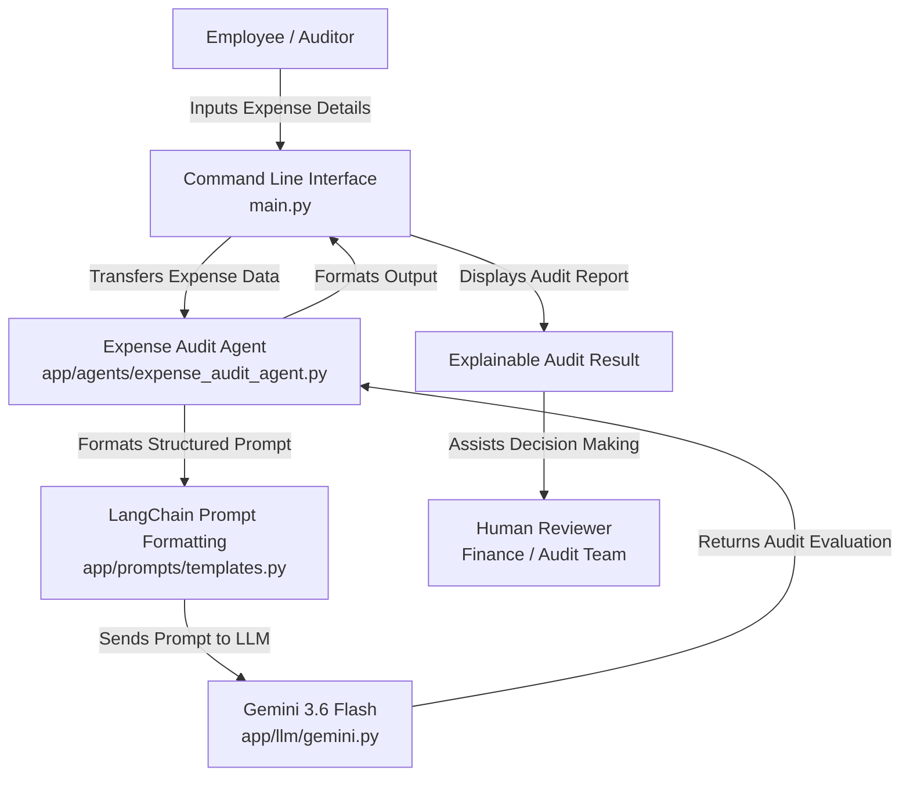

# Enterprise Employee Expense Intelligence & Audit System

[](https://www.python.org/)
[](https://www.langchain.com/)
[](https://ai.google.dev/)
[-informational.svg)]()

An AI-powered enterprise expense intelligence and auditing system designed to assist corporate audit teams and employees by analyzing expense submissions, identifying potential compliance and policy gaps, highlighting missing documentation, and providing clear, explainable audit insights.

---

## 1. Overview

The **Enterprise Employee Expense Intelligence & Audit System** is an AI-assisted compliance and decision-support solution. In its current implementation, the system provides a foundational **Expense Audit Agent** that accepts structured and semi-structured employee expense claims, evaluates them against standard expense auditing dimensions, and generates transparent, explainable audit findings for human reviewers.

---

## 2. Problem Statement

Enterprise expense auditing faces several common operational challenges:
- **Time-Consuming Manual Review**: Audit and finance teams spend significant hours manually reviewing repetitive reimbursement claims.
- **Unstructured Submissions**: Expense details submitted by employees often lack complete line-item breakdowns, receipts, or context.
- **Inconsistent Policy Compliance Checks**: Manually identifying policy violations across hundreds of submissions leads to fatigue and human oversight.
- **Ambiguity for Employees**: Employees often do not clearly understand why a claim requires clarification or what supporting documentation is expected.

---

## 3. Solution

The system addresses these challenges through an AI-powered **Expense Audit Agent** that:
- Ingests and interprets employee expense submissions.
- Classifies expenses into business categories (e.g., travel, accommodation, meals).
- Highlights key observations and detects missing details (e.g., itemized bills, travel dates, business justifications).
- Flags potential compliance and policy concerns.
- Provides a contextual risk assessment when sufficient data is available.
- Recommends clear, actionable next steps for employees and finance teams.
- Operates strictly as a **decision-support tool** for human reviewers rather than making autonomous financial approval or rejection decisions.

---

## 4. Current Milestone

### **Milestone 1 – Agent Foundation Development**

The repository currently contains the foundational agent layer:
- **Python Project Setup**: Clean modular project structure with environment configuration.
- **Gemini LLM Integration**: Direct and LangChain-based integration with Google's `gemini-3.6-flash`.
- **LangChain Integration**: `ChatGoogleGenerativeAI` and `ChatPromptTemplate` for prompt structuring and execution.
- **Structured Prompt Engineering**: System prompts embedding responsible AI rules, expense analysis schema, and output guidelines.
- **Foundational Expense Audit Agent**: Core audit analysis logic in `app/agents/expense_audit_agent.py`.
- **Interactive CLI Interface**: Terminal-based user interface (`main.py`) for submitting claims and viewing audit results.
- **Explainable Audit Output**: Structured audit reports containing classification, observations, policy notes, risk review, and next steps.
- **Responsible AI Safeguards**: Grounding rules preventing hallucinated company policies, false accusations, or automated approvals.
- **Unit & Integration Testing**: Test scripts validating model connectivity, prompt rendering, agent logic, and end-to-end execution.

---

## 5. Key Features

- **CLI-Based Expense Input**: Interactive command-line prompt collecting employee name, expense type, amount, purpose, date, and description.
- **Automated Expense Classification**: Categorizes claims (e.g., domestic travel, accommodation, office supplies).
- **Key Observation Extraction**: Extracts pertinent details and identifies potential inconsistencies (e.g., timeline mismatches).
- **Missing Information Identification**: Identifies missing line-item receipts, invoices, or approvals.
- **Policy & Compliance Flagging**: Evaluates claims and notes when internal company policies must be verified.
- **Explainable Risk Assessment**: Provides qualitative risk indicators based strictly on available evidence.
- **Actionable Next Steps**: Generates guidance for submission completion and finance review.
- **Human-in-the-Loop Architecture**: Designed exclusively to assist human reviewers in decision-making.
- **Responsible AI Guardrails**: Strict constraints against hallucinating rules or assigning definitive fraud labels.

---

## 6. Architecture



---

## 7. Technology Stack

- **Programming Language**: Python 3.10+
- **LLM Orchestration**: [LangChain](https://github.com/langchain-ai/langchain) (`langchain`, `langchain-core`)
- **LLM Provider Integration**: [`langchain-google-genai`](https://github.com/langchain-ai/langchain-google) & [`google-genai`](https://github.com/googleapis/python-genai)
- **Foundation Model**: Google Gemini 3.6 Flash (`gemini-3.6-flash`)
- **Configuration & Environment**: [`python-dotenv`](https://github.com/theskumar/python-dotenv)
- **User Interface**: Python Command Line Interface (CLI)
- **Environment Management**: Python Virtual Environment (`venv`)

---

## 8. Project Structure

```
enterprise-expense-intelligence-audit/
├── app/
│   ├── __init__.py
│   ├── agents/
│   │   ├── __init__.py
│   │   └── expense_audit_agent.py    # Core expense analysis agent logic
│   ├── llm/
│   │   ├── __init__.py
│   │   └── gemini.py                  # Gemini LLM initialization & configuration
│   └── prompts/
│       ├── __init__.py
│       └── templates.py               # Structured LangChain prompt templates & guardrails
├── tests/
│   ├── __init__.py
│   ├── test_expense_agent.py         # Test for expense agent execution
│   ├── test_expense_prompt.py        # Test for prompt formatting & system message
│   └── test_gemini_module.py         # Test for app LLM module integration
├── .gitignore                         # Git exclusion rules (.env, venv, pycache)
├── main.py                            # CLI application entry point
├── requirements.txt                   # Project dependencies
├── test_gemini.py                     # Direct Gemini API connection test
├── test_langchain.py                  # LangChain + Gemini connection test
├── test_prompt.py                     # Basic ChatPromptTemplate validation test
└── README.md                          # Project documentation
```

---

## 9. How It Works

1. **Expense Ingestion**: The user runs `main.py` and enters expense parameters (Employee Name, Expense Type, Amount in ₹, Purpose, Date, and Description) via the CLI.
2. **Payload Construction**: The input details are formatted into a structured text payload.
3. **Agent Invocation**: The `analyze_expense()` function in `app/agents/expense_audit_agent.py` is invoked.
4. **Prompt Assembly**: The LangChain `expense_audit_prompt` injects system guardrails and employee expense data.
5. **LLM Inference**: The request is processed by `gemini-3.6-flash` via `ChatGoogleGenerativeAI`.
6. **Audit Synthesis**: The agent generates a structured, explainable audit breakdown.
7. **Human Review Presentation**: The CLI displays the audit findings for final evaluation by an auditor or finance manager.

---

## 10. Responsible AI Safeguards

The system embeds specific Responsible AI principles within its system instructions:
- **No Autonomous Approvals/Rejections**: The AI does not make binding financial transactions or final approval decisions.
- **No Unsubstantiated Accusations**: The agent avoids accusatory language or definitive claims of fraud.
- **No Policy Hallucination**: The agent never invents company policies, spending thresholds, or per-diem rules.
- **Explicit Missing Information Reporting**: If receipts, invoices, or business contexts are omitted, the agent explicitly flags them as missing.
- **Explicit Policy Disclaimer**: When company-specific travel/expense guidelines are not supplied, the agent explicitly states that compliance cannot be verified.
- **Human-in-the-Loop**: All outputs are formatted as decision support for human auditors.

---

## 11. Example Usage & Output

### Input
```text
Employee Name: Hareesh
Expense Type: Travel
Amount (₹): 5000
Purpose: Official trip
Date: 20-08-2026
Description: Travel expenses for the previous official trip to Vizag
```

### Generated Audit Result (Dynamic Output Summary)
```text
============================================================
AUDIT RESULT
------------------------------------------------------------
1. Expense Classification:
   - Domestic Business Travel (Local/Intercity transit)

2. Key Observations:
   - Claim submitted for ₹5,000 for an official trip to Vizag.
   - Date specified (20-08-2026) indicates a timeline check may be required.
   - The description mentions a past trip but lacks a breakdown of transportation modes.

3. Potential Policy or Compliance Concerns:
   - Company-specific travel policy was not provided; compliance with daily allowances or travel class limits cannot be verified.
   - Missing itemized billings and supporting travel receipts/tickets.

4. Risk Assessment:
   - Requires Review / Low-to-Medium Risk due to missing itemized breakdown and supporting travel documentation.

5. Recommended Next Steps:
   - Request the employee to provide itemized invoices/tickets (e.g., flight/train/fuel bills).
   - Forward the claim to the reporting manager and finance team for policy alignment review.
------------------------------------------------------------
```

---

## 12. Testing & Verification

The following verification and validation tests have been implemented and executed:

| Test Script | Scope / Description |
| :--- | :--- |
| `test_gemini.py` | Direct connection to Google Gemini API using `google-genai` client. |
| `test_langchain.py` | Integration test verifying LangChain's `ChatGoogleGenerativeAI` wrapper. |
| `test_prompt.py` | Validates `ChatPromptTemplate` variable binding and prompt execution. |
| `tests/test_gemini_module.py` | Validates the modular LLM initialization in `app/llm/gemini.py`. |
| `tests/test_expense_prompt.py` | Tests system prompt and human prompt formatting for expense auditing. |
| `tests/test_expense_agent.py` | Functional test of the `analyze_expense` agent workflow with sample data. |
| `main.py` | End-to-end user experience test via the CLI interface. |

> **Note on External API Quota**: During development, temporary `429 RESOURCE_EXHAUSTED` rate-limit responses were observed when exceeding Gemini free-tier burst limits. Graceful error handling was added in `main.py`, and the workflow was successfully retested.

---

## 13. Limitations & Current Scope

The current implementation represents **Milestone 1 (Agent Foundation)**. 

The following capabilities are **NOT** yet implemented in the current codebase:
- Multi-agent coordination and orchestration
- Persistent long-term memory across sessions
- External company policy document indexing/retrieval (RAG)
- Automated receipt OCR / image document parsing
- Automated approval workflow execution
- Enterprise REST APIs or backend microservices
- Web-based user interface / dashboard

---

## 14. Future Roadmap

Planned enhancements for subsequent milestones include:
- **Tool Integration**: External currency converters, distance calculators, and calendar verifiers.
- **Policy Retrieval (RAG)**: Indexing enterprise policy handbooks using vector databases for automated rule matching.
- **Multimodal Document Parsing**: Extracting line items directly from scanned receipts and PDF invoices.
- **Multi-Agent Coordination**: Specialized agents (Policy Agent, Fraud Detection Agent, Manager Approval Agent) collaborating via an orchestrator.
- **Persistent Memory**: Historical audit tracking for individual employees and cost centers.
- **Workflow Automation**: Integration with ERP systems (SAP, Oracle, Workday).
- **Enterprise API & Web UI**: RESTful endpoints and a modern web dashboard for finance teams.

---

## 15. Security & Configuration

- **Environment Variables**: API keys are loaded exclusively from `.env` via `python-dotenv`.
- **Git Protection**: `.env` and `venv/` are explicitly excluded in `.gitignore` to prevent secret leakage.
- **API Key Handling**: API keys must never be hardcoded or checked into source control.

---

## 16. Installation & Setup

### Prerequisites
- Python 3.10 or higher
- A Google Gemini API Key ([Get an API key here](https://aistudio.google.com/))
- Git installed on your machine

### 1. Clone the Repository
```bash
git clone https://github.com/your-username/enterprise-expense-intelligence-audit.git
cd enterprise-expense-intelligence-audit
```

### 2. Create and Activate a Virtual Environment
- **On Windows (PowerShell):**
  ```powershell
  python -m venv venv
  venv\Scripts\Activate.ps1
  ```
- **On Windows (Command Prompt):**
  ```cmd
  python -m venv venv
  venv\Scripts\activate.bat
  ```
- **On macOS/Linux:**
  ```bash
  python3 -m venv venv
  source venv/bin/activate
  ```

### 3. Install Dependencies
```bash
pip install -r requirements.txt
```

### 4. Configure Environment Variables
Create a `.env` file in the root directory:
```bash
GEMINI_API_KEY=your_actual_gemini_api_key_here
```

---

## 17. Running the Application

To run the interactive CLI application:

```bash
python main.py
```

Follow the on-screen prompts to input expense details and receive the AI agent's audit insights.

To run individual test scripts:
```bash
python test_gemini.py
python tests/test_expense_agent.py
```

---

## 18. Author

- **Kaza Venkata Hareesh**
- B.Tech Computer Science and Engineering (CSE)
- Anurag University

---

## 19. Project Context

Developed as part of the **Infosys SpringBoard Virtual Internship 7.0**.
