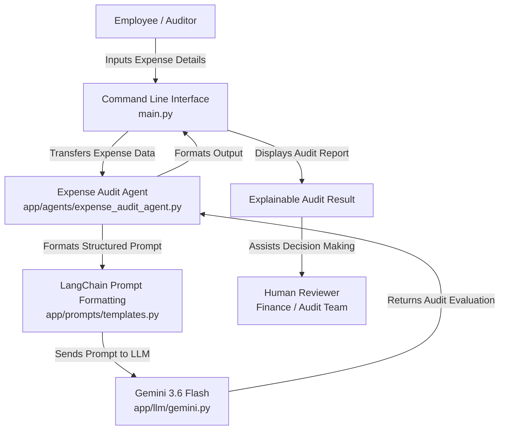
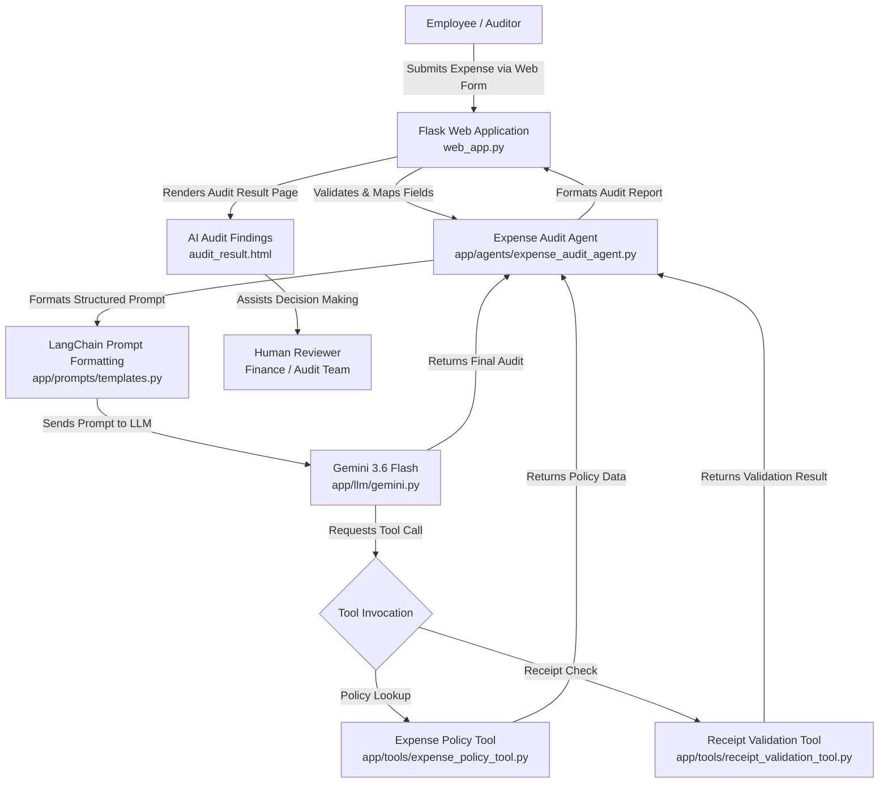

# Enterprise Employee Expense Intelligence & Audit System

[](https://www.python.org/)
[](https://www.langchain.com/)
[](https://ai.google.dev/)
[-informational.svg)]()

An AI-powered enterprise expense intelligence and auditing system designed to assist corporate audit teams and employees by analyzing expense submissions, identifying potential compliance and policy gaps, highlighting missing documentation, and providing clear, explainable audit insights.

---

## 1. Overview

The **Enterprise Employee Expense Intelligence & Audit System** is an AI-assisted compliance and decision-support solution. In its current implementation, the system provides a foundational **Expense Audit Agent** that accepts structured and semi-structured employee expense claims, evaluates them against standard expense auditing dimensions, and generates transparent, explainable audit findings for human reviewers.

---

## 2. Problem Statement

Enterprise expense auditing faces several common operational challenges:
- **Time-Consuming Manual Review**: Audit and finance teams spend significant hours manually reviewing repetitive reimbursement claims.
- **Unstructured Submissions**: Expense details submitted by employees often lack complete line-item breakdowns, receipts, or context.
- **Inconsistent Policy Compliance Checks**: Manually identifying policy violations across hundreds of submissions leads to fatigue and human oversight.
- **Ambiguity for Employees**: Employees often do not clearly understand why a claim requires clarification or what supporting documentation is expected.

---

## 3. Solution

The system addresses these challenges through an AI-powered **Expense Audit Agent** that:
- Ingests and interprets employee expense submissions.
- Classifies expenses into business categories (e.g., travel, accommodation, meals).
- Highlights key observations and detects missing details (e.g., itemized bills, travel dates, business justifications).
- Flags potential compliance and policy concerns.
- Provides a contextual risk assessment when sufficient data is available.
- Recommends clear, actionable next steps for employees and finance teams.
- Operates strictly as a **decision-support tool** for human reviewers rather than making autonomous financial approval or rejection decisions.

---

## 4. Current Milestone

### **Milestone 1 – Agent Foundation Development**

The repository currently contains the foundational agent layer:
- **Python Project Setup**: Clean modular project structure with environment configuration.
- **Gemini LLM Integration**: Direct and LangChain-based integration with Google's `gemini-3.6-flash`.
- **LangChain Integration**: `ChatGoogleGenerativeAI` and `ChatPromptTemplate` for prompt structuring and execution.
- **Structured Prompt Engineering**: System prompts embedding responsible AI rules, expense analysis schema, and output guidelines.
- **Foundational Expense Audit Agent**: Core audit analysis logic in `app/agents/expense_audit_agent.py`.
- **Interactive CLI Interface**: Terminal-based user interface (`main.py`) for submitting claims and viewing audit results.
- **Explainable Audit Output**: Structured audit reports containing classification, observations, policy notes, risk review, and next steps.
- **Responsible AI Safeguards**: Grounding rules preventing hallucinated company policies, false accusations, or automated approvals.
- **Unit & Integration Testing**: Test scripts validating model connectivity, prompt rendering, agent logic, and end-to-end execution.

---

## 5. Key Features

- **CLI-Based Expense Input**: Interactive command-line prompt collecting employee name, expense type, amount, purpose, date, and description.
- **Automated Expense Classification**: Categorizes claims (e.g., domestic travel, accommodation, office supplies).
- **Key Observation Extraction**: Extracts pertinent details and identifies potential inconsistencies (e.g., timeline mismatches).
- **Missing Information Identification**: Identifies missing line-item receipts, invoices, or approvals.
- **Policy & Compliance Flagging**: Evaluates claims and notes when internal company policies must be verified.
- **Explainable Risk Assessment**: Provides qualitative risk indicators based strictly on available evidence.
- **Actionable Next Steps**: Generates guidance for submission completion and finance review.
- **Human-in-the-Loop Architecture**: Designed exclusively to assist human reviewers in decision-making.
- **Responsible AI Guardrails**: Strict constraints against hallucinating rules or assigning definitive fraud labels.

---

## 6. Architecture



---

## 7. Technology Stack

- **Programming Language**: Python 3.10+
- **LLM Orchestration**: [LangChain](https://github.com/langchain-ai/langchain) (`langchain`, `langchain-core`)
- **LLM Provider Integration**: [`langchain-google-genai`](https://github.com/langchain-ai/langchain-google) & [`google-genai`](https://github.com/googleapis/python-genai)
- **Foundation Model**: Google Gemini 3.6 Flash (`gemini-3.6-flash`)
- **Configuration & Environment**: [`python-dotenv`](https://github.com/theskumar/python-dotenv)
- **User Interface**: Python Command Line Interface (CLI)
- **Environment Management**: Python Virtual Environment (`venv`)

---

## 8. Project Structure

```
enterprise-expense-intelligence-audit/
├── app/
│   ├── __init__.py
│   ├── agents/
│   │   ├── __init__.py
│   │   └── expense_audit_agent.py    # Core expense analysis agent logic
│   ├── llm/
│   │   ├── __init__.py
│   │   └── gemini.py                  # Gemini LLM initialization & configuration
│   └── prompts/
│       ├── __init__.py
│       └── templates.py               # Structured LangChain prompt templates & guardrails
├── tests/
│   ├── __init__.py
│   ├── test_expense_agent.py         # Test for expense agent execution
│   ├── test_expense_prompt.py        # Test for prompt formatting & system message
│   └── test_gemini_module.py         # Test for app LLM module integration
├── .gitignore                         # Git exclusion rules (.env, venv, pycache)
├── main.py                            # CLI application entry point
├── requirements.txt                   # Project dependencies
├── test_gemini.py                     # Direct Gemini API connection test
├── test_langchain.py                  # LangChain + Gemini connection test
├── test_prompt.py                     # Basic ChatPromptTemplate validation test
└── README.md                          # Project documentation
```

---

## 9. How It Works

1. **Expense Ingestion**: The user runs `main.py` and enters expense parameters (Employee Name, Expense Type, Amount in ₹, Purpose, Date, and Description) via the CLI.
2. **Payload Construction**: The input details are formatted into a structured text payload.
3. **Agent Invocation**: The `analyze_expense()` function in `app/agents/expense_audit_agent.py` is invoked.
4. **Prompt Assembly**: The LangChain `expense_audit_prompt` injects system guardrails and employee expense data.
5. **LLM Inference**: The request is processed by `gemini-3.6-flash` via `ChatGoogleGenerativeAI`.
6. **Audit Synthesis**: The agent generates a structured, explainable audit breakdown.
7. **Human Review Presentation**: The CLI displays the audit findings for final evaluation by an auditor or finance manager.

---

## 10. Responsible AI Safeguards

The system embeds specific Responsible AI principles within its system instructions:
- **No Autonomous Approvals/Rejections**: The AI does not make binding financial transactions or final approval decisions.
- **No Unsubstantiated Accusations**: The agent avoids accusatory language or definitive claims of fraud.
- **No Policy Hallucination**: The agent never invents company policies, spending thresholds, or per-diem rules.
- **Explicit Missing Information Reporting**: If receipts, invoices, or business contexts are omitted, the agent explicitly flags them as missing.
- **Explicit Policy Disclaimer**: When company-specific travel/expense guidelines are not supplied, the agent explicitly states that compliance cannot be verified.
- **Human-in-the-Loop**: All outputs are formatted as decision support for human auditors.

---

## 11. Example Usage & Output

### Input
```text
Employee Name: Hareesh
Expense Type: Travel
Amount (₹): 5000
Purpose: Official trip
Date: 20-08-2026
Description: Travel expenses for the previous official trip to Vizag
```

### Generated Audit Result (Dynamic Output Summary)
```text
============================================================
AUDIT RESULT
------------------------------------------------------------
1. Expense Classification:
   - Domestic Business Travel (Local/Intercity transit)

2. Key Observations:
   - Claim submitted for ₹5,000 for an official trip to Vizag.
   - Date specified (20-08-2026) indicates a timeline check may be required.
   - The description mentions a past trip but lacks a breakdown of transportation modes.

3. Potential Policy or Compliance Concerns:
   - Company-specific travel policy was not provided; compliance with daily allowances or travel class limits cannot be verified.
   - Missing itemized billings and supporting travel receipts/tickets.

4. Risk Assessment:
   - Requires Review / Low-to-Medium Risk due to missing itemized breakdown and supporting travel documentation.

5. Recommended Next Steps:
   - Request the employee to provide itemized invoices/tickets (e.g., flight/train/fuel bills).
   - Forward the claim to the reporting manager and finance team for policy alignment review.
------------------------------------------------------------
```

---

## 12. Testing & Verification

The following verification and validation tests have been implemented and executed:

| Test Script | Scope / Description |
| :--- | :--- |
| `test_gemini.py` | Direct connection to Google Gemini API using `google-genai` client. |
| `test_langchain.py` | Integration test verifying LangChain's `ChatGoogleGenerativeAI` wrapper. |
| `test_prompt.py` | Validates `ChatPromptTemplate` variable binding and prompt execution. |
| `tests/test_gemini_module.py` | Validates the modular LLM initialization in `app/llm/gemini.py`. |
| `tests/test_expense_prompt.py` | Tests system prompt and human prompt formatting for expense auditing. |
| `tests/test_expense_agent.py` | Functional test of the `analyze_expense` agent workflow with sample data. |
| `main.py` | End-to-end user experience test via the CLI interface. |

> **Note on External API Quota**: During development, temporary `429 RESOURCE_EXHAUSTED` rate-limit responses were observed when exceeding Gemini free-tier burst limits. Graceful error handling was added in `main.py`, and the workflow was successfully retested.

---

## 13. Limitations & Current Scope

The current implementation represents **Milestone 1 (Agent Foundation)**. 

The following capabilities are **NOT** yet implemented in the current codebase:
- Multi-agent coordination and orchestration
- Persistent long-term memory across sessions
- External company policy document indexing/retrieval (RAG)
- Automated receipt OCR / image document parsing
- Automated approval workflow execution
- Enterprise REST APIs or backend microservices
- Web-based user interface / dashboard

---

## 14. Future Roadmap

Planned enhancements for subsequent milestones include:
- **Tool Integration**: External currency converters, distance calculators, and calendar verifiers.
- **Policy Retrieval (RAG)**: Indexing enterprise policy handbooks using vector databases for automated rule matching.
- **Multimodal Document Parsing**: Extracting line items directly from scanned receipts and PDF invoices.
- **Multi-Agent Coordination**: Specialized agents (Policy Agent, Fraud Detection Agent, Manager Approval Agent) collaborating via an orchestrator.
- **Persistent Memory**: Historical audit tracking for individual employees and cost centers.
- **Workflow Automation**: Integration with ERP systems (SAP, Oracle, Workday).
- **Enterprise API & Web UI**: RESTful endpoints and a modern web dashboard for finance teams.

---

## 15. Security & Configuration

- **Environment Variables**: API keys are loaded exclusively from `.env` via `python-dotenv`.
- **Git Protection**: `.env` and `venv/` are explicitly excluded in `.gitignore` to prevent secret leakage.
- **API Key Handling**: API keys must never be hardcoded or checked into source control.

---

## 16. Installation & Setup

### Prerequisites
- Python 3.10 or higher
- A Google Gemini API Key ([Get an API key here](https://aistudio.google.com/))
- Git installed on your machine

### 1. Clone the Repository
```bash
git clone https://github.com/your-username/enterprise-expense-intelligence-audit.git
cd enterprise-expense-intelligence-audit
```

### 2. Create and Activate a Virtual Environment
- **On Windows (PowerShell):**
  ```powershell
  python -m venv venv
  venv\Scripts\Activate.ps1
  ```
- **On Windows (Command Prompt):**
  ```cmd
  python -m venv venv
  venv\Scripts\activate.bat
  ```
- **On macOS/Linux:**
  ```bash
  python3 -m venv venv
  source venv/bin/activate
  ```

### 3. Install Dependencies
```bash
pip install -r requirements.txt
```

### 4. Configure Environment Variables
Create a `.env` file in the root directory:
```bash
GEMINI_API_KEY=your_actual_gemini_api_key_here
```

---

## 17. ### Running the Web Application

The Flask-based expense audit interface can be launched from the project root after installing the required dependencies and configuring the Gemini API key.

```bash
python web_app.py
```

Open the local URL displayed by Flask in your browser.

Note: The web application currently operates without database persistence. Expense submissions and audit results are not stored permanently.


---

## 18. Author

- **Kaza Venkata Hareesh**
- B.Tech Computer Science and Engineering (CSE)
- Anurag University

---

## 19. Project Context

Developed as part of the **Infosys SpringBoard Virtual Internship 7.0**.

---

## 20. Milestone 2 — Tool Integration & Action Execution

### 20.1 Milestone Overview

Milestone 2 extends the foundational Expense Audit Agent (built in Milestone 1) with **enterprise tool integration**, **structured error handling**, and a **professional web-based user interface** for expense submission and AI-powered audit analysis.

The key objectives of this milestone were:
- Developing and integrating **enterprise-relevant tools** (Expense Policy Tool, Receipt Validation Tool) into the LangChain-based agent workflow.
- Enabling the AI agent to **autonomously invoke tools** during expense analysis to retrieve policy data and validate receipt consistency.
- Implementing **robust exception handling** across the Gemini API, tool invocations, and incomplete audit execution paths.
- Building a **responsive, professional web interface** using Flask, HTML, CSS, and JavaScript for expense submission, audit initiation, and result presentation.
- Refining the **AI agent's classification and policy reasoning** to prevent hallucinated categories, enforce single-category policy lookup, and distinguish required fields from optional fields.

---

### 20.2 Tools Developed

#### 20.2.1 Expense Policy Tool (`app/tools/expense_policy_tool.py`)

A LangChain `@tool`-decorated function that retrieves simulated company expense policy rules based on the submitted expense category.

| Feature | Detail |
| :--- | :--- |
| **Supported Categories** | Domestic Travel (limit ₹3,500), Business Meals (limit ₹1,500), Hotel Accommodation (limit ₹5,000) |
| **Category Aliases** | Resolves variations such as "domestic travel" → travel, "hotel" / "lodging" → accommodation, "business meals" → meals |
| **Policy Data Returned** | Category name, reimbursement limit, receipt requirement, and approval requirement above limit |
| **Unknown Categories** | Returns a clear "No company policy found..." message |

> **Note**: The policy data is **simulated** and is not connected to any real company's policy management system. It is intended for development and demonstration purposes within this internship project.

#### 20.2.2 Receipt Validation Tool (`app/tools/receipt_validation_tool.py`)

A LangChain `@tool`-decorated function that performs basic completeness and consistency checks on submitted receipt details.

**Validation checks performed:**
1. **Receipt Availability** — Early exit with "Manual review required" if no receipt is provided.
2. **Merchant Verification** — Checks that a non-empty merchant name is present.
3. **Receipt Date Validation** — Validates date format (YYYY-MM-DD).
4. **Amount Validation** — Ensures receipt amount is greater than zero and matches the claimed expense amount.
5. **Date Consistency** — Compares the receipt date against the expense date and flags discrepancies.

**Output format:** Structured text beginning with `Receipt Validation: BASIC CHECK PASSED` or `Receipt Validation: REQUIRES REVIEW`, followed by itemized findings and any detected issues.

> **Note**: This tool performs **basic consistency checks only**. It does not verify receipt authenticity, perform OCR on uploaded images, or independently confirm policy compliance.

---

### 20.3 AI Agent Tool Integration

The expense audit agent (`app/agents/expense_audit_agent.py`) integrates tool outputs into the analysis workflow as follows:

1. **Prompt Assembly** — The agent formats a structured prompt using `ChatPromptTemplate` with system-level reasoning rules and the employee's expense details.
2. **Direct Receipt Validation** — When receipt details are provided, the agent directly invokes `validate_receipt.invoke()` and appends the validation result to the LLM's context as additional evidence.
3. **LLM-Driven Policy Lookup** — The agent binds `get_expense_policy` as a callable tool via `llm.bind_tools()`. During inference, Gemini autonomously decides when to invoke the policy tool based on the expense category and submits a `tool_call` request, which the agent resolves in a loop (up to 5 iterations).
4. **Tool Result Integration** — Tool responses are appended as `ToolMessage` objects to the conversation, enabling the LLM to incorporate policy limits and receipt validation findings into its final audit narrative.
5. **Final Audit Generation** — Once all tool calls are resolved, the agent returns the LLM's structured audit response containing classification, observations, policy concerns, risk assessment, and recommended next steps.

**Refined Reasoning Rules (System Prompt):**
- The agent treats the **employee-selected Expense Category as the primary category** for policy lookup.
- It does **not infer secondary categories** from the Purpose or Description fields.
- If the Purpose appears inconsistent with the selected category, the agent flags a **category-purpose mismatch** and recommends clarification rather than cross-applying unrelated policy limits.
- The agent distinguishes **required fields** (Employee Name, Category, Amount, Date, Purpose) from **optional fields** (Description) and does not flag a blank optional Description as a policy violation.
- All existing guardrails are preserved: no final financial approvals/rejections, no definitive fraud accusations, and no fabricated policy requirements.

---

### 20.4 Error Handling and Exception Management

Milestone 2 implements structured exception handling at multiple layers:

| Layer | Failure Scenario | Behavior |
| :--- | :--- | :--- |
| **Gemini API** | API quota exhaustion, network failure, or model error | Returns a standardized fallback message: *"AI audit unavailable. Gemini could not complete the expense analysis."* The agent does not crash or return an incomplete analysis as a successful result. |
| **Tool Invocation** | `get_expense_policy` or `validate_receipt` raises an exception during execution | The exception is caught; a `ToolMessage` with a structured failure description (*"Tool execution failed: [ErrorType]"*) is appended to the conversation, allowing the LLM to acknowledge the failure in its response. |
| **Incomplete Audit** | The agent exhausts the maximum tool-call loop (5 iterations) without reaching a final response | Returns: *"The agent could not complete the analysis within the allowed tool-call steps."* |
| **Web Layer** | Unexpected exception during `analyze_expense()` invocation from Flask | Caught by the Flask route handler; the audit result page renders with `audit_status = "error"` and a user-facing error message instead of an unhandled server error. |

The system is designed to **communicate failures explicitly** rather than presenting an incomplete or erroneous audit as a successful result.

---

### 20.5 Web-Based User Interface

A professional, responsive web interface was built using Flask, Bootstrap 5, and custom CSS/JavaScript to replace the CLI-only interaction model from Milestone 1.

#### 20.5.1 Expense Audit Dashboard (`/`)

- **Executive KPI Cards** displaying Total Claimed, Pending Audits, Flagged Claims, and Compliance Rate (initialized at zero in the current empty-state phase).
- **Recent Expenses Table** with an isolated horizontal scroll container for smaller screens.
- **AI Audit Status Panel** and **Policy Reference Widget** for quick access.
- **Empty-state design** with a clear information banner indicating no database records are connected.

#### 20.5.2 Expense Submission Form (`/submit-expense`)

- **Two-section layout**: General Expense Details and Receipt Documentation.
- **Form fields**: Employee Name, Expense Category (Travel / Meals / Accommodation), Claimed Amount (₹), Expense Date, Purpose, Description (optional), Receipt Available (Yes/No), and conditional receipt fields (Merchant, Receipt Date, Receipt Amount).
- **File upload**: Drag-and-drop dropzone supporting PDF, JPG, JPEG, and PNG files with a 5 MB size limit. Image files display a local thumbnail preview; PDF files display a document icon. Users can replace or remove the selected file before submission.
- **Client-side validation**: Required field checks, positive amount validation, and first-error focus.
- **Server-side validation**: Comprehensive validation of all fields including category verification, date format parsing, conditional receipt field requirements, and in-memory file inspection (extension and size checks).

> **Note**: Uploaded receipt files are validated in-memory for type and size but are **not persisted to disk or processed using OCR**. The audit uses the submitted receipt detail fields (merchant, date, amount) for basic validation.

#### 20.5.3 AI Audit Result Page (`/submit-expense` POST → `audit_result.html`)

- **Claim Overview Grid** summarizing submitted expense details.
- **Receipt Information Section** displaying receipt validation status.
- **AI Audit Findings Display** with three distinct visual states:
  - ✅ **Success** — Full audit report rendered with structured findings.
  - ⚠️ **Unavailable** — Warning state when Gemini could not complete the analysis.
  - ❌ **Error** — Error state for unexpected service/network failures.
- **Print/Save** functionality with a print-optimized media query.
- **Submit Another Expense** navigation link.

#### 20.5.4 Responsive Design

- **Desktop (≥1200px)**: Fixed sidebar navigation with full dashboard layout.
- **Tablet (768px–1199px)**: Sidebar adapts; KPI cards wrap to 2 columns.
- **Mobile (<768px)**: Sidebar collapses into a toggleable off-canvas drawer with backdrop overlay; KPI cards display in 1 column; tables and panels stack vertically.
- Sidebar remains **fixed/stationary** and does not scroll with the page content.

---

### 20.6 Testing and Validation

The following tests were implemented during Milestone 2:

| Test File | Type | Description | Status |
| :--- | :--- | :--- | :--- |
| `tests/test_expense_policy_tool.py` | Smoke Test | Invokes `get_expense_policy` with `"travel"` and prints the returned policy dictionary. No formal assertions. | Implemented (manual verification) |
| `tests/test_receipt_validation_tool.py` | Smoke Test | Invokes `validate_receipt` with a deliberate date mismatch scenario and prints the structured output. No formal assertions. | Implemented (manual verification) |
| `tests/test_gemini_error_handling.py` | Unit Test (Mocked) | Patches `llm_with_tools` with a `RuntimeError` to verify that `analyze_expense()` returns the `"AI audit unavailable"` fallback message instead of crashing. | Implemented; assertions verified via manual code trace |
| `tests/test_policy_tool_error_handling.py` | Unit Test (Mocked) | Simulates a tool invocation failure during the agent's policy lookup loop and verifies the agent completes with a `"manual review"` message. | Implemented; assertions verified via manual code trace |
| `tests/test_reasoning_refinements.py` | Unit Test Suite (Mocked) | Four tests verifying: (1) refined system prompt contains all required reasoning rules, (2) agent performs single-category policy lookup without inferring secondary categories, (3) category-purpose mismatch is detected and flagged, (4) blank optional Description is not flagged as a policy violation. | Implemented; all assertions verified via manual code trace against source |
| `tests/test_expense_agent.py` | Integration Test (Live API) | Calls `analyze_expense()` with sample hotel expense data using the live Gemini API. Prints the generated audit report. Requires a valid `GEMINI_API_KEY`. | Implemented; requires live API key for execution |

> **Important**: The mocked unit tests (`test_gemini_error_handling.py`, `test_policy_tool_error_handling.py`, `test_reasoning_refinements.py`) have been **verified through manual code trace** — every assertion was checked against the actual source code and confirmed to be logically correct. However, automated test execution via `pytest` in the development environment encountered a shell configuration issue. The test files are ready for execution in any standard Python environment with the project's virtual environment activated.

**Web UI Testing**: The expense submission form, server-side validation, AI agent invocation, and audit result rendering were verified through manual end-to-end testing via the Flask development server.

---

### 20.7 Technologies Used (Milestone 2)

| Technology | Role in Milestone 2 |
| :--- | :--- |
| **Python 3.10+** | Core programming language for tools, agent logic, and Flask application |
| **LangChain** (`langchain`, `langchain-core`) | Agent orchestration, tool binding (`@tool`, `bind_tools`), prompt templates, and message handling |
| **Google Gemini 3.6 Flash** (`langchain-google-genai`, `google-genai`) | Foundation LLM for expense analysis, tool-call generation, and audit narrative synthesis |
| **Flask** | Web application framework serving the dashboard, form, and audit result pages |
| **HTML5 / CSS3** | Responsive page templates and enterprise-themed styling (navy/blue design system) |
| **Bootstrap 5.3** | UI component framework for responsive grid, cards, forms, navigation, and alerts |
| **Bootstrap Icons 1.11** | Icon library for navigation, status indicators, and UI elements |
| **JavaScript (Vanilla)** | Client-side interactivity: sidebar toggle, file upload/preview, form validation, loading states |
| **Jinja2** | Server-side HTML templating via Flask's built-in template engine |
| **pytest** | Test framework for unit and integration test execution |

---

### 20.8 Known Limitations and Future Improvements

**Current Limitations:**
- **Simulated Policy Data** — Expense policies are defined as static dictionaries within the codebase. No connection to an external policy management system or document repository exists.
- **No Database Persistence** — The application operates in a fully stateless mode. Submitted expenses, audit results, and KPI metrics are not persisted to any database. The dashboard displays zero-state metrics.
- **Uploaded Receipts Not Stored** — Receipt files are validated in-memory (type and size) but are not saved to disk, cloud storage, or any persistent store.
- **No OCR Processing** — Uploaded receipt images and PDFs are not processed using OCR or any document parsing technology. The audit relies on manually entered receipt detail fields.
- **Advisory Audit Results** — AI-generated audit findings are strictly advisory. The system does not make final financial approval or rejection decisions and does not assign definitive fraud labels.
- **Single-Category Policy** — The system supports three predefined expense categories (Travel, Meals, Accommodation). Categories outside this set return a "no policy found" response.
- **Flask Not in requirements.txt** — Flask is used by the web application (`web_app.py`) but is not currently listed in `requirements.txt`. It should be added for complete dependency documentation.
- **Shell Execution Constraint** — Automated test execution via `pytest` encountered a development environment shell resolution issue. Tests are structurally correct and can be executed in any standard Python environment.

**Planned Future Improvements:**
- Database integration (MySQL) for persistent expense records, audit trails, and dynamic KPI metrics.
- Receipt file storage and optional OCR-based data extraction.
- Policy retrieval from external enterprise document sources (RAG-based approach).
- Multi-agent coordination for specialized audit workflows.
- Enhanced analytics and reporting dashboards.

---

### 20.9 Screenshots

> **Note**: No UI screenshots have been added to the repository at this time. The following screenshots can be captured and added in a future update:
> - Expense Audit Dashboard (empty state with KPI cards)
> - Expense Submission Form (with receipt upload section)
> - AI Audit Result Page (successful audit findings)
> - AI Audit Result Page (unavailable/error states)
> - Mobile responsive view (sidebar drawer, stacked layout)
>
> Once screenshots are captured, they can be placed in a `screenshots/` directory and referenced here using relative paths (e.g., ``).

---

### 20.10 Milestone Summary

Milestone 2 transforms the foundational Expense Audit Agent from Milestone 1 into a **tool-integrated, web-accessible expense intelligence system**. The agent now autonomously retrieves company policy data and validates receipt consistency using purpose-built LangChain tools, produces structured audit narratives grounded in retrieved evidence, and handles failures gracefully across all system layers.

The addition of a professional web interface — comprising an executive dashboard, a validated expense submission form with file upload, and a detailed AI audit result page — provides a realistic enterprise interaction model that replaces the CLI-only interface from Milestone 1.

Together, these enhancements demonstrate the practical integration of AI agent tool-use capabilities, structured error handling, and user-facing web application development within an enterprise expense auditing context.

---

### Milestone 2 Updated Architecture



### Milestone 2 Updated Project Structure

```
enterprise-expense-intelligence-audit/
├── app/
│   ├── __init__.py
│   ├── agents/
│   │   ├── __init__.py
│   │   └── expense_audit_agent.py       # Core expense analysis agent with tool integration
│   ├── llm/
│   │   ├── __init__.py
│   │   └── gemini.py                     # Gemini LLM initialization & configuration
│   ├── prompts/
│   │   ├── __init__.py
│   │   └── templates.py                  # Refined prompt templates with reasoning rules
│   └── tools/
│       ├── __init__.py
│       ├── expense_policy_tool.py        # Simulated company expense policy retrieval tool
│       └── receipt_validation_tool.py    # Receipt completeness & consistency validation tool
├── static/
│   ├── css/
│   │   └── dashboard.css                 # Enterprise finance dashboard & form styling
│   └── js/
│       └── dashboard.js                  # Client-side interactivity & form validation
├── templates/
│   ├── base.html                         # Base layout with responsive sidebar navigation
│   ├── dashboard.html                    # Finance executive dashboard (empty state)
│   ├── submit_expense.html               # Expense submission form with receipt upload
│   └── audit_result.html                 # AI audit findings display page
├── tests/
│   ├── __init__.py
│   ├── test_expense_agent.py            # Live integration test for expense agent
│   ├── test_expense_policy_tool.py      # Expense Policy Tool smoke test
│   ├── test_expense_prompt.py           # Prompt formatting inspection utility
│   ├── test_gemini_error_handling.py    # Gemini API failure handling unit test
│   ├── test_gemini_module.py            # LLM module connectivity test
│   ├── test_policy_tool_error_handling.py  # Policy tool failure handling unit test
│   ├── test_reasoning_refinements.py    # Reasoning refinement unit test suite
│   └── test_receipt_validation_tool.py  # Receipt Validation Tool smoke test
├── .gitignore
├── main.py                               # CLI application entry point
├── web_app.py                            # Flask web application entry point
├── requirements.txt                      # Project dependencies
├── test_gemini.py                        # Direct Gemini API connection test
├── test_langchain.py                     # LangChain + Gemini connection test
├── test_prompt.py                        # Basic ChatPromptTemplate validation test
└── README.md                             # Project documentation
```
