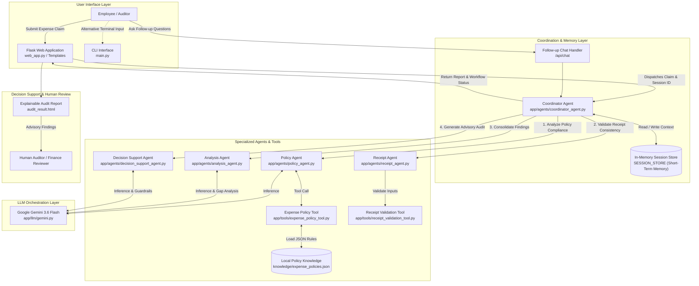

# Enterprise Employee Expense Intelligence & Audit System

[](https://www.python.org/)
[](https://flask.palletsprojects.com/)
[](https://www.langchain.com/)
[](https://ai.google.dev/)
[-informational.svg)]()
[]()

An AI-powered enterprise expense intelligence and auditing system designed to assist corporate audit teams and employees by analyzing expense submissions, validating receipt consistency, evaluating company policy rules, highlighting compliance gaps, and generating explainable, advisory audit insights with conversational memory.

---

## Table of Contents

- [1. Project Overview](#1-project-overview)
- [2. Problem Statement](#2-problem-statement)
- [3. Solution and Key Features](#3-solution-and-key-features)
- [4. System Architecture](#4-system-architecture)
- [5. Technology Stack](#5-technology-stack)
- [6. Project Structure](#6-project-structure)
- [7. Milestone Progression](#7-milestone-progression)
  - [Milestone 1 — Agent Foundation Development](#milestone-1--agent-foundation-development)
  - [Milestone 2 — Tool Integration & Action Execution](#milestone-2--tool-integration--action-execution)
  - [Milestone 3 — Agent Coordination & Memory Systems](#milestone-3--agent-coordination--memory-systems)
- [8. How the System Works](#8-how-the-system-works)
- [9. Installation and Configuration](#9-installation-and-configuration)
- [10. Running the Application](#10-running-the-application)
- [11. Testing and Validation](#11-testing-and-validation)
- [12. Security and Responsible AI](#12-security-and-responsible-ai)
- [13. Limitations and Current Scope](#13-limitations-and-current-scope)
- [14. Future Enhancements](#14-future-enhancements)
- [15. Author and Project Context](#15-author-and-project-context)

---

## 1. Project Overview

The **Enterprise Employee Expense Intelligence & Audit System** is an AI-assisted compliance and decision-support platform. It assists enterprise finance teams, internal auditors, and employees by automating the preliminary evaluation of business expense claims.

The system uses a collaborative **Multi-Agent Architecture** orchestrated with LangChain and Google Gemini to evaluate claims across policy, documentation, and risk dimensions. It operates strictly as an **advisory decision-support system**: it produces transparent audit narratives to help human reviewers make informed decisions, without making binding financial approvals or rejections.

---

## 2. Problem Statement

Corporate expense auditing routinely faces operational bottlenecks:
- **Time-Consuming Manual Auditing**: Finance departments spend substantial manual effort reviewing high volumes of routine reimbursement claims.
- **Unstructured and Incomplete Submissions**: Expense claims often lack itemized breakdowns, clear business justifications, or matching receipt records.
- **Inconsistent Policy Enforcement**: Complex policy rules (e.g., category-specific spending caps, receipt thresholds) are difficult to verify consistently across teams.
- **Lack of Employee Guidance**: Employees frequently face claim rejections or delays without clear explanations of policy rules or missing documentation.
- **Need for Audit Explainability**: Automated auditing tools must provide transparent, step-by-step reasoning rather than opaque approval/rejection flags.

---

## 3. Solution and Key Features

The system implements a coordinated multi-agent workflow that inspects expense submissions through specialized auditing roles:

- **Web-Based Expense Intake**: Modern Flask interface featuring an executive dashboard, an expense submission form, and in-memory receipt file inspection (PDF, JPG, PNG up to 5 MB).
- **Multi-Agent Coordination**: A central `CoordinatorAgent` executes and manages four specialized sub-agents: `PolicyAgent`, `ReceiptAgent`, `AnalysisAgent`, and `DecisionSupportAgent`.
- **Policy Retrieval Tool**: An `@tool`-decorated function (`get_expense_policy`) retrieving spending limits, receipt requirements, and approval criteria from a structured local knowledge base (`knowledge/expense_policies.json`).
- **Receipt Consistency Validation**: A dedicated `@tool` (`validate_receipt`) verifying merchant presence, date alignment, positive amounts, and claimed-vs-receipt amount matching.
- **Category & Reason Alignment**: Prompt-level reasoning rules preventing hallucinated expense categories, enforcing single-category policy evaluation, and detecting category-purpose mismatches.
- **Conversational Short-Term Memory**: In-memory session tracking (`SESSION_STORE`) allowing users to ask interactive follow-up questions regarding their audit report via `/api/chat`.
- **Isolated Error Handling**: Layered exception handling for Gemini API rate limits (`429 RESOURCE_EXHAUSTED`), tool execution failures, and agent execution paths.
- **Human-in-the-Loop Safeguards**: Outputs are strictly advisory with explicit disclaimers when policies or receipts are absent.

---

## 4. System Architecture

The following diagram illustrates the multi-agent system architecture and the end-to-end data flow:


```mermaid
flowchart TD
    subgraph UI_Layer ["User Interface Layer"]
        User["Employee / Auditor"]
        WebUI["Flask Web Application\nweb_app.py / Templates"]
        CLI["CLI Interface\nmain.py"]
    end

    subgraph Coordination_Layer ["Coordination & Memory Layer"]
        Coord["Coordinator Agent\napp/agents/coordinator_agent.py"]
        Memory[("In-Memory Session Store\nSESSION_STORE (Short-Term Memory)")]
        FollowUp["Follow-up Chat Handler\n/api/chat"]
    end

    subgraph Specialist_Agents ["Specialized Agents & Tools"]
        PolicyAg["Policy Agent\napp/agents/policy_agent.py"]
        PolicyTool["Expense Policy Tool\napp/tools/expense_policy_tool.py"]
        Knowledge[("Local Policy Knowledge\nknowledge/expense_policies.json")]

        ReceiptAg["Receipt Agent\napp/agents/receipt_agent.py"]
        ReceiptTool["Receipt Validation Tool\napp/tools/receipt_validation_tool.py"]

        AnalysisAg["Analysis Agent\napp/agents/analysis_agent.py"]
        DecisionAg["Decision Support Agent\napp/agents/decision_support_agent.py"]
    end

    subgraph LLM_Layer ["LLM Orchestration Layer"]
        Gemini["Google Gemini 3.6 Flash\napp/llm/gemini.py"]
    end

    subgraph Review_Layer ["Decision Support & Human Review"]
        AuditReport["Explainable Audit Report\naudit_result.html"]
        HumanReviewer["Human Auditor / Finance Reviewer"]
    end

    User -->|Submit Expense Claim| WebUI
    User -.->|Alternative Terminal Input| CLI
    WebUI -->|Dispatches Claim & Session ID| Coord
    Coord <-->|Read / Write Context| Memory

    Coord -->|1. Analyze Policy Compliance| PolicyAg
    PolicyAg <-->|Tool Call| PolicyTool
    PolicyTool <-->|Load JSON Rules| Knowledge
    PolicyAg <-->|Inference| Gemini

    Coord -->|2. Validate Receipt Consistency| ReceiptAg
    ReceiptAg -->|Validate Inputs| ReceiptTool

    Coord -->|3. Consolidate Findings| AnalysisAg
    AnalysisAg <-->|Inference & Gap Analysis| Gemini

    Coord -->|4. Generate Advisory Audit| DecisionAg
    DecisionAg <-->|Inference & Guardrails| Gemini

    Coord -->|Return Report & Workflow Status| WebUI
    WebUI --> AuditReport
    AuditReport -->|Advisory Findings| HumanReviewer

    User -->|Ask Follow-up Questions| FollowUp
    FollowUp --> Coord
```

---

## 5. Technology Stack

| Component | Technology / Library | Purpose in Current Implementation |
| :--- | :--- | :--- |
| **Programming Language** | Python 3.10+ | Core application, agents, tools, and test implementations |
| **Web Framework** | Flask | Serves executive dashboard, submission form, audit report, and `/api/chat` |
| **Front-End Design** | HTML5, CSS3, JavaScript | Custom dashboard layout, responsive sidebar drawer, and dynamic chat box |
| **CSS Framework** | Bootstrap 5.3 & Bootstrap Icons | Responsive UI components, cards, tables, modal structures, and icons |
| **LLM Orchestration** | LangChain (`langchain`, `langchain-core`) | Agent abstractions, `@tool` binding, structured prompt templates, message routing |
| **LLM Integration** | `langchain-google-genai` & `google-genai` | Interface and connectivity to Google Gemini foundation models |
| **Foundation Model** | Google Gemini 3.6 Flash (`gemini-3.6-flash`) | Natural language understanding, policy reasoning, and report generation |
| **Policy Knowledge Base** | JSON (`knowledge/expense_policies.json`) | Local structured store for company expense limits and receipt rules |
| **Environment Management** | `python-dotenv` | Loads API keys and configurations securely from `.env` |
| **Testing Framework** | `pytest` & `unittest.mock` | Unit testing, agent mocking, error handling verification, and workflow tests |

---

## 6. Project Structure

```
enterprise-expense-intelligence-audit/
├── app/
│   ├── __init__.py
│   ├── agents/
│   │   ├── __init__.py
│   │   ├── analysis_agent.py          # Synthesizes policy and receipt findings
│   │   ├── coordinator_agent.py       # Orchestrates multi-agent workflow & session memory
│   │   ├── decision_support_agent.py  # Generates final cautious advisory audit report
│   │   ├── expense_audit_agent.py     # Standalone agent with autonomous tool calling
│   │   ├── policy_agent.py            # Evaluates policy rules using policy tool
│   │   └── receipt_agent.py           # Validates receipt data using receipt tool
│   ├── llm/
│   │   ├── __init__.py
│   │   ├── error_handler.py           # Quota (429) & runtime exception classification
│   │   └── gemini.py                  # Gemini LLM initialization (ChatGoogleGenerativeAI)
│   ├── prompts/
│   │   ├── __init__.py
│   │   └── templates.py               # Prompt templates & responsible AI guardrails
│   └── tools/
│       ├── __init__.py
│       ├── expense_policy_tool.py     # Retrieves policy limits from JSON / fallback dict
│       └── receipt_validation_tool.py # Validates merchant, dates, amounts, and discrepancies
├── knowledge/
│   └── expense_policies.json          # Local enterprise policy rules knowledge base
├── static/
│   ├── css/
│   │   └── dashboard.css              # Responsive styles for dashboard & audit reports
│   └── js/
│       └── dashboard.js               # Client-side validation, dropzone, and UI logic
├── templates/
│   ├── audit_result.html              # Rendered AI audit report & follow-up chat widget
│   ├── base.html                      # Base template with responsive sidebar drawer
│   ├── dashboard.html                 # Finance executive KPI overview (empty state)
│   └── submit_expense.html            # Validated expense claim form with receipt upload
├── tests/
│   ├── __init__.py
│   ├── test_expense_agent.py          # Live integration test for single-agent workflow
│   ├── test_expense_policy_tool.py    # Smoke test for expense policy retrieval tool
│   ├── test_expense_prompt.py         # Test for prompt formatting & system messages
│   ├── test_gemini_error_handling.py  # Mocked test for Gemini API failure handling
│   ├── test_gemini_module.py          # Connectivity check for app.llm.gemini module
│   ├── test_m3_workflow.py            # Comprehensive test suite for Milestone 3 multi-agent workflow
│   ├── test_policy_tool_error_handling.py # Mocked test for policy tool failure handling
│   ├── test_reasoning_refinements.py  # Mocked test suite for policy reasoning rules
│   └── test_receipt_validation_tool.py# Smoke test for receipt validation tool
├── .env.example                       # Environment variable template
├── .gitignore                         # Excludes .env, venv/, and cache files
├── main.py                            # Interactive CLI entry point
├── web_app.py                         # Flask web application entry point
├── requirements.txt                   # Declared project dependencies
├── test_gemini.py                     # Direct Gemini SDK connection test
├── test_langchain.py                  # LangChain + Gemini connection test
├── test_prompt.py                     # Basic ChatPromptTemplate test
└── README.md                          # Project documentation
```

---

## 7. Milestone Progression

### Milestone 1 — Agent Foundation Development
- **Core Agent Setup**: Developed foundational `Expense Audit Agent` using Python, LangChain, and `gemini-3.6-flash`.
- **Prompt Engineering**: Created structured prompt templates enforcing responsible AI guidelines (no fraud accusations, no fabricated policies).
- **Terminal Interface**: Created `main.py` enabling employees to submit expense parameters via command-line prompts.
- **Initial Verification**: Verified API connectivity and prompt rendering via standalone test scripts (`test_gemini.py`, `test_langchain.py`, `test_prompt.py`).

### Milestone 2 — Tool Integration & Action Execution
- **Tool Development**:
  - `Expense Policy Tool` (`app/tools/expense_policy_tool.py`): Retrieves simulated reimbursement limits for Travel (₹3,500), Meals (₹1,500), and Accommodation (₹5,000).
  - `Receipt Validation Tool` (`app/tools/receipt_validation_tool.py`): Performs consistency checks on merchant names, receipt dates, positive amounts, and claimed-vs-receipt discrepancies.
- **Autonomous Tool Calling**: Configured Gemini to autonomously call tools during inference via `llm.bind_tools()`.
- **Reasoning Refinements**: Embedded strict prompt rules to evaluate primary selected categories only, detect category-purpose mismatches, and treat descriptions as optional.
- **Web User Interface**: Built responsive Flask web application (`web_app.py`) featuring an executive KPI dashboard, form validation, in-memory receipt upload inspection, and structured audit result rendering.
- **Structured Error Handling**: Implemented error classification for `429 RESOURCE_EXHAUSTED` quota events and tool exceptions.

### Milestone 3 — Agent Coordination & Memory Systems
- **Multi-Agent Decomposition**: Transitioned from a single monolithic agent to a specialized multi-agent architecture orchestrated by `CoordinatorAgent`:
  1. `PolicyAgent`: Resolves policy constraints via tool lookup.
  2. `ReceiptAgent`: Validates receipt metadata and detects discrepancies.
  3. `AnalysisAgent`: Synthesizes policy and receipt findings to identify risks and missing evidence.
  4. `DecisionSupportAgent`: Produces the final explainable audit report using advisory language.
- **Short-Term Conversational Memory**: Implemented `SESSION_STORE` keyed by Flask `session_id`, enabling interactive follow-up questions in the web interface via `/api/chat`.
- **Local Policy Knowledge Base**: Externalized enterprise policy rules into `knowledge/expense_policies.json` for modular policy maintenance.
- **Isolated Failure Isolation**: Individual agent failures are captured gracefully, updating the workflow status indicators (`Completed` / `Failed`) without halting the pipeline or fabricating data.
- **Milestone 3 Test Suite**: Created `tests/test_m3_workflow.py` validating standard workflows, over-limit claims, missing receipts, tool failures, memory persistence, and quota resilience.

---

## 8. How the System Works

```
1. Submission  ──>  2. Ingestion  ──>  3. Multi-Agent Audit  ──>  4. Report  ──>  5. Follow-Up
```

1. **Expense Submission**:
   - The user opens the web application (`http://127.0.0.1:5000/submit-expense`) and enters expense details (Employee Name, Category, Amount, Date, Purpose, Description) along with optional receipt metadata and file upload.
2. **Data Validation & Ingestion**:
   - The Flask route validates input completeness, date formats, positive amounts, and file constraints in-memory.
3. **Multi-Agent Pipeline Execution**:
   - The `CoordinatorAgent` initializes a session context in `SESSION_STORE`.
   - **Step 1 — Policy Audit**: `PolicyAgent` invokes `get_expense_policy` to retrieve category thresholds from `knowledge/expense_policies.json`.
   - **Step 2 — Receipt Audit**: `ReceiptAgent` invokes `validate_receipt` to verify merchant, amount matching, and date alignment.
   - **Step 3 — Analysis**: `AnalysisAgent` prompts Gemini to synthesize policy compliance and receipt findings.
   - **Step 4 — Decision Support**: `DecisionSupportAgent` generates a structured advisory report with risk assessments and next steps.
4. **Audit Report Presentation**:
   - `audit_result.html` renders the claim summary, agent workflow status badges, and structured audit findings.
5. **Interactive Follow-Up (Conversational Memory)**:
   - Users can type clarifying questions into the follow-up chat box. The `CoordinatorAgent` retrieves past context from `SESSION_STORE` and responds via Gemini without losing audit state.

---

## 9. Installation and Configuration

### Prerequisites
- Python 3.10 or higher
- A Google Gemini API Key ([Google AI Studio](https://aistudio.google.com/))
- Git installed on your system

### 1. Clone the Repository
```bash
git clone https://github.com/your-username/enterprise-expense-intelligence-audit.git
cd enterprise-expense-intelligence-audit
```

### 2. Create and Activate a Virtual Environment
- **On Windows (PowerShell):**
  ```powershell
  python -m venv venv
  .\venv\Scripts\Activate.ps1
  ```
- **On Windows (Command Prompt):**
  ```cmd
  python -m venv venv
  venv\Scripts\activate.bat
  ```
- **On macOS/Linux:**
  ```bash
  python3 -m venv venv
  source venv/bin/activate
  ```

### 3. Install Dependencies
```bash
pip install -r requirements.txt
```

> **Note on Dependencies**: `Flask` and `pytest` are used by the application and test suites. Ensure they are present in your active environment:
> ```bash
> pip install flask pytest
> ```

### 4. Configure Environment Variables
Create a `.env` file in the project root based on `.env.example`:
```env
GEMINI_API_KEY=your_actual_gemini_api_key_here
```

---

## 10. Running the Application

### Running the Web Application (Recommended)
Launch the Flask development server from the project root:

```bash
python web_app.py
```

Open your browser and navigate to:
```
http://127.0.0.1:5000/
```

- **Executive Dashboard**: `http://127.0.0.1:5000/`
- **Submit Expense**: `http://127.0.0.1:5000/submit-expense`
- **Health Check API**: `http://127.0.0.1:5000/api/health`

### Running the CLI Interface
The terminal-based interface remains functional for direct CLI testing:

```bash
python main.py
```

---

## 11. Testing and Validation

The test suite covers unit testing, mocked tool execution, error handling, and multi-agent coordination.

### Test Suite Overview

| Test Module | Test Type | Verification Focus | Status |
| :--- | :--- | :--- | :--- |
| `tests/test_m3_workflow.py` | Unit / Workflow (Mocked) | Multi-agent coordination, over-limit checks, missing receipts, memory recall, 429 quota handling | Automated (`pytest`) |
| `tests/test_reasoning_refinements.py` | Unit (Mocked) | Primary category filtering, category-purpose mismatch checks, optional field handling | Automated (`pytest` / Python) |
| `tests/test_gemini_error_handling.py` | Unit (Mocked) | Graceful fallback when Gemini encounters runtime errors | Automated (`pytest` / Python) |
| `tests/test_policy_tool_error_handling.py` | Unit (Mocked) | Graceful fallback during policy tool exceptions | Automated (`pytest` / Python) |
| `tests/test_expense_policy_tool.py` | Smoke Test | Verifies policy dictionary retrieval for valid categories | Manual / Script |
| `tests/test_receipt_validation_tool.py` | Smoke Test | Verifies date mismatch and amount validation checks | Manual / Script |
| `tests/test_expense_agent.py` | Live Integration Test | End-to-end single agent analysis (requires live `GEMINI_API_KEY`) | Live API Test |
| `tests/test_gemini_module.py` | Connectivity Test | Verifies `app.llm.gemini` model invocation | Live API Test |

### Running the Tests
To execute all automated unit and workflow tests:

```bash
pytest tests/test_m3_workflow.py tests/test_reasoning_refinements.py tests/test_gemini_error_handling.py tests/test_policy_tool_error_handling.py
```

To run individual standalone test scripts:
```bash
python -m tests.test_reasoning_refinements
python -m tests.test_gemini_error_handling
python -m tests.test_policy_tool_error_handling
```

> **API Quota Note**: Live API tests require an active `GEMINI_API_KEY`. Free-tier accounts may occasionally experience `429 RESOURCE_EXHAUSTED` rate limits during high-frequency testing. The system includes built-in exception handling to manage quota pauses cleanly.

---

## 12. Security and Responsible AI

The project strictly follows ethical AI and enterprise security guidelines:

### Security Guardrails
- **Credential Protection**: API keys are loaded via environment variables (`.env`) and excluded from Git via `.gitignore`.
- **In-Memory File Handling**: Uploaded files are validated in-memory for size and MIME type and are never written to disk or publicly exposed.
- **Log Sanitization**: `app/llm/error_handler.py` masks sensitive API keys from server-side error logs.

### Responsible AI Principles
- **Advisory Decision Support**: The system never makes binding financial approvals or claim rejections. Final decisions rest entirely with human auditors.
- **No Definitive Fraud Accusations**: Findings use measured compliance language (*"potential policy violation"*, *"category-purpose mismatch"*, *"requires human review"*) rather than accusatory claims.
- **No Fabricated Policies**: If a submitted category is missing from `knowledge/expense_policies.json`, the agent explicitly states that policy compliance cannot be verified.
- **Clear Identification of Missing Information**: Missing receipts, unitemized bills, or date gaps are highlighted explicitly to guide the employee.

---

## 13. Limitations and Current Scope

The system is currently in **Milestone 3 (Coordination & Memory Systems)**. The following limitations apply to the current codebase:

- **Simulated Policy Data**: Policies are maintained in a local JSON file (`knowledge/expense_policies.json`) covering three categories (Travel, Meals, Accommodation), not an external enterprise policy engine.
- **In-Memory Session Store**: Short-term conversational context is maintained in a Python dictionary (`SESSION_STORE`). Session data resets if the web server restarts.
- **No Database Persistence**: Expense claims, audit reports, and dashboard metrics are stateless and not persisted in a SQL/NoSQL database.
- **No Receipt OCR / Image Parsing**: Receipt files are validated for size and format, but receipt text is not automatically extracted via OCR. Validation relies on user-entered receipt metadata.
- **No Live ERP Integration**: The application does not connect to enterprise accounting platforms (e.g., SAP, Oracle, Workday).

---

## 14. Future Enhancements

The following capabilities represent potential roadmap enhancements:

- **Persistent Database Storage**: Integration with PostgreSQL or MySQL to persist expense histories, audit logs, and dashboard analytics.
- **Multimodal OCR Receipt Parsing**: Automated receipt data extraction from uploaded images and PDFs using vision LLMs or OCR engines.
- **Enterprise Policy RAG**: Vector-database-backed Retrieval-Augmented Generation (RAG) indexing complete corporate policy handbooks.
- **ERP & Accounting Connectors**: Webhook and REST API connectors for automated export to corporate ERP systems.
- **Enhanced Role-Based Access Control (RBAC)**: Distinct views and permission tiers for Employees, Managers, and Compliance Auditors.

---

## 15. Author and Project Context

- **Author**: Kaza Venkata Hareesh
- **Academic Background**: B.Tech in Computer Science and Engineering (CSE), Anurag University
- **Program**: Developed as part of the **Infosys Springboard Virtual Internship 7.0**
- **Track**: AI Agent Coordination & Enterprise Expense Intelligence
